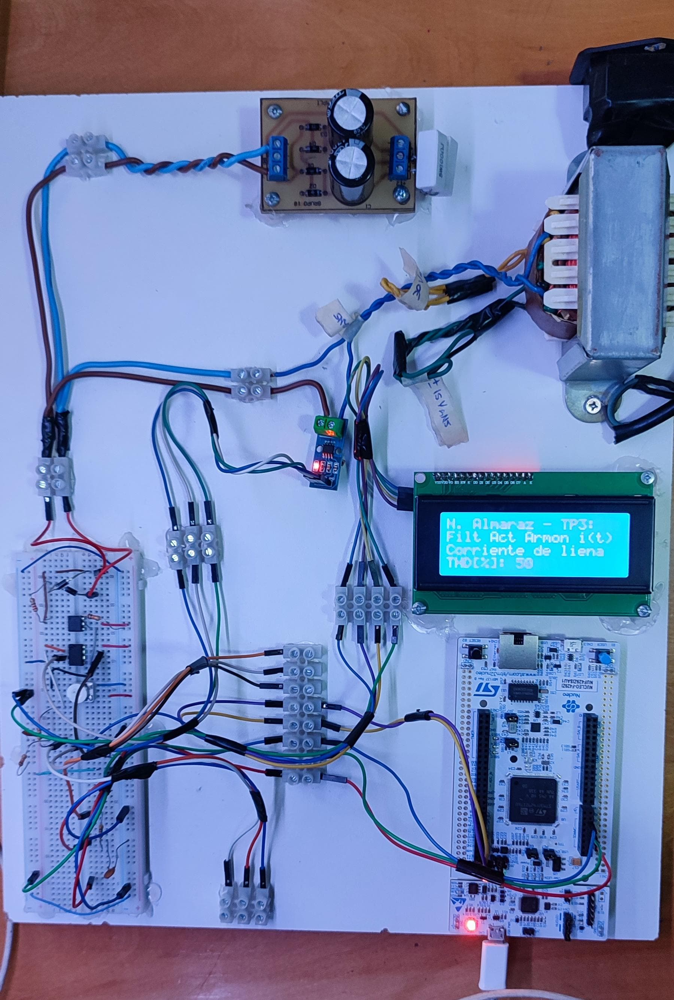

# filtro_activo_armonicos_corriente

## Requerimientos

| Grupo de Requerimiento  | Requerimiento  | Descripción                                                                                                         | Estado |
|-------------------------|----------------|---------------------------------------------------------------------------------------------------------------------|--------|
| Aislamiento             | 1.0            | La lógica en todo momento debe estar aislada de la línea de 24 VCA                                                  |✅|
| Sincronización          | 2.0            | El sistema se sincroniza con la linea mediante un detector de ciclos                                                |✅|
| Sensado de corriente    | 3.1            | El sistema deberá tener un filtro anti-alias a la entrada (f0 = 5 kHz).                                             |✅|
| Sensado de corriente    | 3.2            | El ADC tomará muestras de corriente de línea con fs = 10 kHz (Ts = 50 us) por una ventana de 50 ciclos              |🛠️|
| Salida analógica        | 4.1            | La salida para mostrar la señal correctora será vía DAC                                                             |🛠️|
| Sistema de buffers      | 5.1            | Se tendrá un esquema double-buffering tanto para tomar muestras como para sacarlas                                  |🛠️|
| Procesamiento           | 6.1            | Se deberá calcular la componente fundamental de corriente                                                           |❌|
| Procesamiento           | 6.2            | Se debe conseguir la "forma de onda correctora" haciendo la resta entre la fundamental y la señal leída             |❌|
| Procesamiento           | 6.3            | El sistema debe corregir en régimen permanente (No importa si el procesamiento / muestreo es lento)                 |❌|
| Display                 | 6.1            | En el display de caracteres LCD se mostrará THD de la señal de entrada                                              |✅|
| Testeo                  | 7.1            | Para verificar el funcionamiento usar el método de la sección "Testeo"                                              |❌|

✅ Terminado 

🛠️ En proceso

❌ No empecé

## Tareas realizadas hasta el 30/08/2024
✅ Armé los circuitos y verifiqué correcto funcionamiento:
- Delay del detector de cruces 500 useg
- El sensor de corriente funcionaba mal si le conectaba directamente el filtro antialias. Le puse un circuito seguidor en el medio y se arregló.

✅ Programé la API del display

✅ Pensé la división en módulos del proyecto completo

✅ Empecé a trabajar en la configuración del ADC para adquirir datos a 20 kHz (aún en proceso)

