<div style="text-align: center;">

# Filtro Activo de Armónicos de Corriente


<div style="text-align: center;">
    <table style="margin: 0 auto; border-collapse: collapse;">
        <tr>
            <td style="text-align: center;">
                <strong>UNIVERSIDAD DE BUENOS AIRES</strong><br>
                Facultad de Ingeniería<br>
                Curso Online de Sistemas Embebidos<br>
		by ARM Book<br>
                
            </td>
            <td style="text-align: center;">
                <strong>UNIVERSIDAD TECNOLÓGICA NACIONAL</strong><br>
                Facultad Regional Buenos Aires<br>
                R5051 Electrónica de Potencia<br>
		Carrera de Grado de Ing. Electrónica<br>
                
            </td>
        </tr>
    </table>
</div>


**Memoria del Trabajo Final:** Filtro Activo de Armónicos de Corriente

**Autor:** Sr. Nicolás Almaraz

**Legajo UTN FRBA:** 175.633-3

*Este trabajo fue realizado en las Ciudad Autónoma de Buenos Aires,  entre marzo y diciembre de 2024.*
</div>

## RESUMEN
En el presente informe se describe el diseño y la implementación de un filtro activo de armónicos de corriente para una red eléctrica monofásica de 9 VAC de tensión eficaz. El objetivo principal del filtro es eliminar las componentes frecuenciales no deseadas en la señal de corriente, lo que permite eliminar la potencia de deformación (D), y corregir la componente reactiva de la potencia consumida, reduciendo así la potencia reactiva (Q). De esta manera, el filtro asegura que el transformador solo entregue potencia activa (S = P), optimizando su capacidad y mejorando la eficiencia del sistema eléctrico. Este desarrollo busca maximizar el aprovechamiento del transformador y contribuir a una red más eficiente.

## Agradecimientos
Este trabajo práctico interdisciplinario surge originalmente como parte del proyecto de la asignatura Electrónica de Potencia, perteneciente a la carrera de Ingeniería Electrónica en la UTN FRBA. La implementación del proyecto requería el uso de un sistema embebido, lo que me llevó a desarrollar dicha solución en el marco del Curso de Sistemas Embebidos.

Quiero expresar mi más profundo agradecimiento a los docentes del Curso de Sistemas Embebidos, quienes no solo me brindaron la oportunidad de participar, sino que también me apoyaron y guiaron en la adquisición de los conocimientos necesarios para la realización de este trabajo práctico.

## Índice General

[1 Introducción general](#1-introducción-general)
   - [1.1 Contexto](#11-contexto)
   - [1.2 Tipos de cargas](#12-tipos-de-cargas)
       - [1.1.2 Cargas LTI](#112-cargas-lti)
           - [1.1.2.1 Características](#1121-características)
           - [1.1.2.2 Triángulo de potencias](#1122-triángulo-de-potencias)
           - [1.1.2.3 Problemas de la potencia reactiva](#1123-problemas-de-la-potencia-reactiva)
       - [1.1.3 Cargas no LTI](#113-cargas-no-lti)
           - [1.1.3.1 Características](#1131-características)
           - [1.1.3.2 Medición de armónicos y THD](#1132-medición-de-armónicos-y-thd)
           - [1.1.3.3 Triángulo de potencias y factor de potencia](#1133-triángulo-de-potencias-y-factor-de-potencia)
           - [1.1.3.4 Problemas de la potencia de deformación](#1134-problemas-de-la-potencia-de-deformación)
   - [1.3 Filtro Activo de Armónicos de Corriente](#13-filtro-activo-de-armónicos-de-corriente)
   - [1.4 Estado del arte](#14-estado-del-arte)
   - [1.5 DSP](#15-dsp)
       - [1.5.1 DMA](#151-dma)
       - [1.5.2 FFT](#152-fft)

[2 Introducción específica](#2-introducción-específica)
   - [2.1 Requisitos](#21-requisitos)
   - [2.2 Casos de uso](#22-casos-de-uso)
   - [2.4 Kit de Desarrollo STM32 Nucleo-F429ZI](#24-kit-de-desarrollo-stm32-nucleo-f429zi)
   - [2.5 Biblioteca de ARM CMSIS - DSP](#25-biblioteca-de-arm-cmsis---dsp)
   - [2.6 STM32Cube IDE](#26-stm32cube-ide)
   - [2.7 Sensor de corriente ACS712-5A](#27-sensor-de-corriente-acs712-5a)

[3 Diseño e implementación](#3-diseño-e-implementación)
   - [3.1 Hardware del filtro activo de armónicos de corriente](#31-hardware-del-filtro-activo-de-armónicos-de-corriente)
       - [3.1.1 Diagrama en bloques general](#311-diagrama-en-bloques-general)
       - [3.1.2 Entrada de fase y neutro](#312-entrada-de-fase-y-neutro)
       - [3.1.3 Detector de ciclos](#313-detector-de-ciclos)
       - [3.1.4 Acondicionamiento del sensor de corriente](#314-acondicionamiento-del-sensor-de-corriente)
       - [3.1.5 Display](#315-display)
       - [3.1.6 Filtro de interpolación](#316-filtro-de-interpolación)
   - [3.2 Firmware del filtro activo de armónicos de corriente](#32-firmware-del-filtro-activo-de-armónicos-de-corriente)
       - [3.2.1 Modularización y capas de software](#321-modularización-y-capas-de-software)
       - [3.2.2 active_current_harmonics_filter](#322-active_current_harmonics_filter)
       - [3.2.3 current_sensor](#323-current_sensor)
       - [3.2.4 signal_analyzer](#324-signal_analyzer)
       - [3.2.5 display](#325-display)
       - [3.2.6 inject_simulator](#326-inject_simulator)
       - [3.2.7 cycle_detector](#327-cycle_detector)

[4 Ensayos y resultados](#4-ensayos-y-resultados)
   - [4.1 Prototipo](#41-prototipo)
   - [4.2 Pruebas funcionales del hardware](#42-pruebas-funcionales-del-hardware)
       - [4.2.1 Circuito detector de ciclos](#421-circuito-detector-de-ciclos)
       - [4.2.2 Acondicionamiento sensor de corriente](#422-acondicionamiento-sensor-de-corriente)
   - [4.3 Pruebas funcionales del firmware](#43-pruebas-funcionales-del-firmware)
       - [4.3.1 current_sensor](#431-current_sensor)
       - [4.3.2 signal_analyzer](#432-signal_analyzer)
       - [4.3.3 display](#433-display)
       - [4.3.4 inject_simulator](#434-inject_simulator)
   - [4.4 Pruebas de integración](#44-pruebas-de-integración)
   - [4.5 Cumplimiento de requisitos](#45-cumplimiento-de-requisitos)

[5 Conclusiones](#5-conclusiones)
   - [5.1 Resultados obtenidos](#51-resultados-obtenidos)
   - [5.2 Próximos pasos](#52-próximos-pasos)

[6 Bibliografía](#6-bibliografía)

[7 Anexos](#7-anexos)
   - [Anexo 1: Review de productos Circutor](#anexo-1-review-de-productos-circutor)
   - [Anexo 2: Notebook FFT](#anexo-2-notebook-fft)
   - [Anexo 3: STM32 Nucleo F429ZI](#anexo-3-stm32-f429zi)
   - [Anexo 4: Biblioteca CMSIS-DSP](#anexo-4-biblioteca-cmsis-dsp)
   - [Anexo 5: STM32Cube IDE](#anexo-5-stm32cube-ide)
   - [Anexo 6: ACS712-5A](#anexo-6-acs712-5a)
   - [Anexo 7: Validación del módulo de firmware signal_analyzer](#anexo-7-validación-del-módulo-de-firmware-signal_analyzer)
   - [Anexo 8: Códigos fuente y Documentación](#anexo-8-códigos-fuente-y-documentación)

# 1 Introducción general

## 1.1 Contexto
Un filtro activo de armónicos de corriente es un componente eléctrico que generalmente se instala en tableros eléctricos para mejorar la calidad de la energía. En la Figura 1.1 se muestra un ejemplo de su aspecto físico, mientras que la Figura 1.2 ilustra instalaciones típicas donde este tipo de filtro podría ser utilizado.

<div style="text-align: center;">
    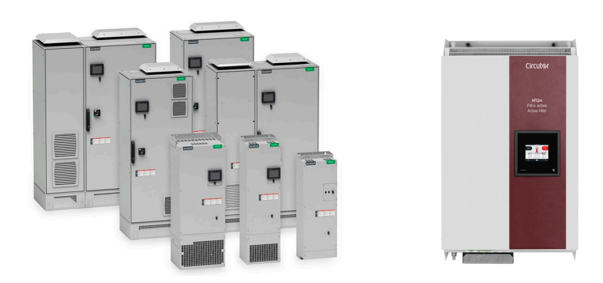

***Figura 1.1:** Filtros activos de armónicos de corriente. A la izquierda, dispositivos de la empresa Schneider; a la derecha, un filtro de la empresa Circutor.*
</div>

<div style="text-align: center;">
    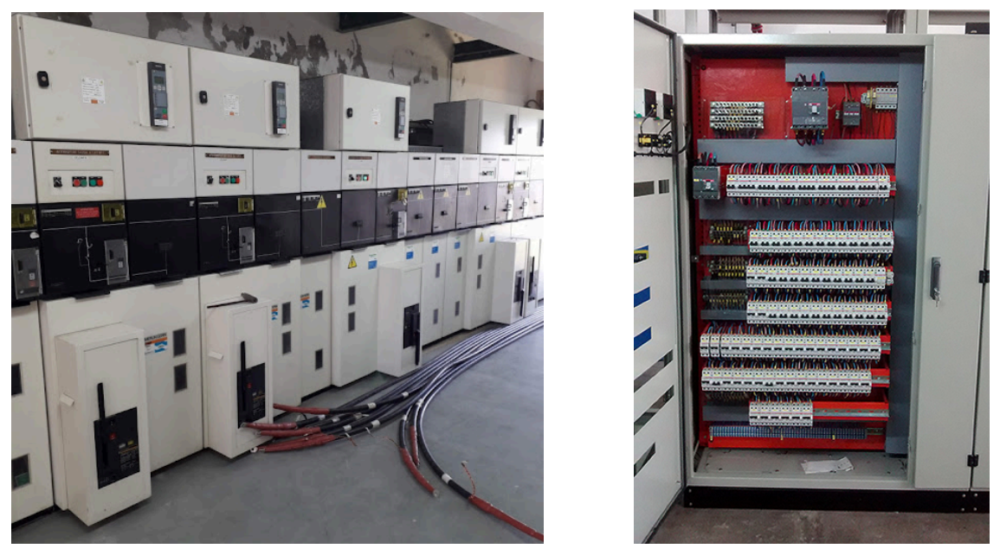
	
***Figura 1.2:** Tableros eléctricos donde se podrían utilizar los filtros. A la izquierda, una sala eléctrica en una instalación de media tensión; a la derecha, un tablero trifásico de baja tensión.*
</div>


En resumen, los filtros activos de armónicos de corriente se emplean comúnmente en instalaciones trifásicas, tanto en media como en baja tensión. 

Un ejemplo de una instalación en media tensión sería el sistema eléctrico de un parque industrial, que recibe energía a 3 x 13,8 kV. En contraste, un supermercado podría ser un ejemplo de una instalación trifásica de baja tensión, con suministro de 3 x 380 V.

## 1.2 Tipos de cargas
Como se menciona en la sección 1.1, los filtros activos de armónicos de corriente se emplean para mejorar la calidad de la energía eléctrica. Esta calidad está fuertemente influenciada por el tipo de cargas que se conectan a la instalación eléctrica. Se denomina carga a cualquier dispositivo o sistema que consuma energía de dicha instalación.

En general, los filtros de armónicos de corriente se utilizan para corregir la potencia reactiva (Q) y la potencia de deformación (D), con el objetivo de maximizar la potencia activa (P) dentro de la potencia total suministrada (S). En un escenario ideal, toda la potencia suministrada debería ser potencia activa, que es la única capaz de realizar trabajo útil.

Matemáticamente, estas relaciones se pueden visualizar a través del triángulo de potencias, mostrado en la Figura 1.3.

<div style="text-align: center;">
    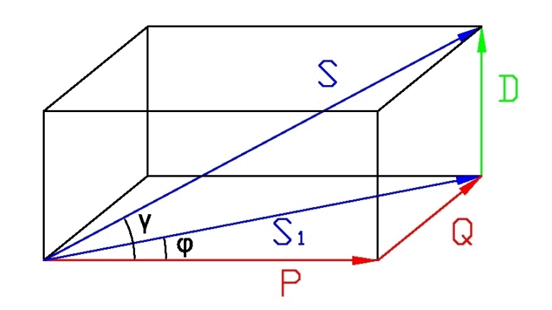
	
***Figura 1.3**: Representación en un espacio tridimensional (R³) de los distintos componentes de potencia.*
</div>

* *S (Potencia aparente):* Es la potencia total suministrada por la empresa distribuidora de energía.
* P (Potencia activa): Es la porción de la potencia que se convierte en trabajo útil o en calor, y es la única que realiza trabajo mecánico efectivo.
* Q (Potencia reactiva): Potencia consumida en cuadratura con la potencia activa. No se disipa, sino que se almacena temporalmente en elementos como inductores y capacitores.
D (Potencia de deformación): Corresponde a la potencia consumida por los armónicos, es decir, las componentes de potencia que se desvían de la frecuencia fundamental (que en Argentina es de 50 Hz).

Para comprender cómo se generan las componentes indeseadas (Q y D) y los problemas que estas conllevan, es necesario estudiar las cargas LTI (lineales e invariantes en el tiempo) y las cargas no LTI (no lineales y/o variantes en el tiempo).

Cabe destacar que, técnica y económicamente, no es necesario implementar filtros activos de armónicos de corriente en instalaciones domiciliarias, ya que los efectos de Q y D no son significativos en este tipo de aplicaciones.

### 1.1.2 Cargas LTI
Dentro del contexto de las instalaciones eléctricas, las cargas LTI (lineales e invariantes en el tiempo) suelen ser componentes pasivos, como resistencias, capacitores e inductores. En un entorno ideal, también podrían incluirse los amplificadores operacionales ideales; sin embargo, estos no son relevantes en el marco de las instalaciones eléctricas.

#### 1.1.2.1 Características

Las cargas LTI tienen la particularidad de que todas las señales en el circuito operan a la misma frecuencia. En la Figura 1.4 se muestra un ejemplo de un sistema LTI, en el cual tanto la tensión en la resistencia, la tensión en el inductor, como la corriente, mantienen la frecuencia del generador.

<div style="text-align: center;">
    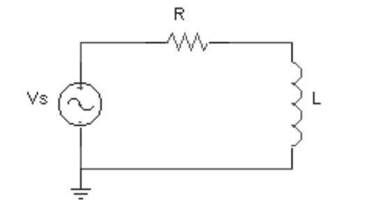
	
***Figura 1.4**: Ejemplo de sistema LTI.*
</div>

Es importante analizar el tipo de energía consumida por las cargas LTI. Desde el punto de vista del generador (en una instalación eléctrica, esto corresponde a un transformador), esto dependerá del ángulo de desfase entre la tensión y la corriente. En la Figura 1.5 se observa este desfase para diferentes tipos de cargas: resistivas puras, inductivas puras y capacitivas puras.

Se puede observar lo siguiente:
* En las cargas resistivas, la tensión está en fase con la corriente.
* En las cargas capacitivas, la corriente adelanta a la tensión.
* En las cargas inductivas, la tensión adelanta a la corriente.

<div style="text-align: center;">
    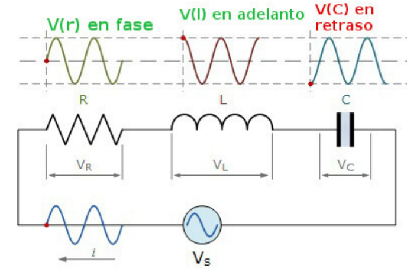
	
***Figura 1.5**:  Representación temporal de los ángulos de fase entre tensión y corriente para diferentes componentes LTI.*
</div>

#### 1.1.2.2 Triángulo de potencias

Como se mencionó en la sección 1.1.2.1, las diferentes cargas LTI producen un determinado desfase entre la tensión y la corriente, lo cual afecta el tipo de potencia consumida. El triángulo de potencias, mostrado en la Figura 1.6, es una representación de estos consumos. Este triángulo es similar al de la Figura 1.3, pero con la salvedad de que, en este caso, la potencia de deformación (D) es nula, es decir, D = 0.

<div style="text-align: center;">
    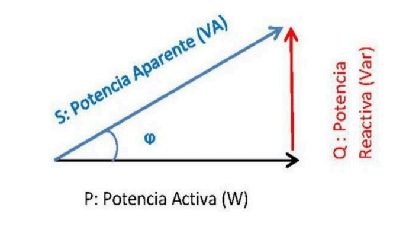
	
***Figura 1.6**: Triángulo de potencias para cargas LTI.*
</div>

1. *Potencia activa (P):* Es la potencia consumida en fase con la tensión, que permite la realización de trabajo útil, como en el caso de las resistencias o de un motor que ejerce fuerza sobre una carga mecánica. Esta es la única potencia que se disipa en el mismo momento en que es suministrada por el generador.
2. *Potencia reactiva (Q):* Es la potencia consumida en cuadratura (90° de desfase) con respecto a la tensión, asociada a la energía almacenada en componentes como capacitores e inductores. Esta potencia no se disipa, sino que se almacena temporalmente y puede ser devuelta en algún momento al sistema.
3. *Potencia aparente (S):* Es la suma cuadrática de la potencia activa y la potencia reactiva. Es la potencia que, desde el punto de vista del generador, "aparentemente" la carga consume, ya que es la energía que le suministra. Sin embargo, como se explicó previamente, no toda esa energía es consumida, ya que solo la potencia activa realiza un trabajo efectivo, mientras que la potencia reactiva se almacena.

El ángulo entre la potencia activa y la potencia reactiva se denomina φ. Usando trigonometría, el cos(φ) se define como:

<div style="text-align: center;">
    <table style="margin: 0 auto;">
        <tr>
            <td>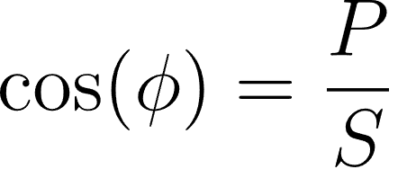</td>
            <td>(1.1)</td>
        </tr>
    </table>
</div>


#### 1.1.2.3 Problemas de la potencia reactiva
Dado que la potencia reactiva no se disipa, implica que ciertos componentes de la carga almacenarán energía. Como se detalla en la sección 1.1.2.1, esto puede generar tres posibles consecuencias:
* Que se mantenga almacenada en la carga.
* Que la carga luego se la entregue a otro componente.
* Que la carga retorne energía a la red.

Este último caso es especialmente problemático, ya que significa que una parte de la energía suministrada por el generador (S) no es consumida por la carga como potencia activa (P), sino que se devuelve a la línea en forma de potencia reactiva (Q). Si la red no tiene otra carga que utilice esta energía retornada, esta se disipará en los cables de la instalación y en el bobinado del transformador, lo cual lleva a sobre-dimensionamientos innecesarios y a una disminución en la eficiencia de la instalación.

Por estas razones, siempre se busca minimizar la potencia reactiva y maximizar la potencia activa. En un escenario ideal, cuando S = P, la potencia reactiva es Q = 0, lo que da como resultado un cos(φ) = 1.

### 1.1.3 Cargas no LTI

Las cargas no LTI (cargas no lineales y/o variantes en el tiempo) son componentes cuya función transferencia no es lineal o cuyo comportamiento depende del tiempo. En el contexto de las instalaciones eléctricas, estas pueden incluir rectificadores, fuentes switching, variadores de frecuencia, inversores, arranques suaves, entre otros.

#### 1.1.3.1 Características

Cuando una carga no LTI se alimenta con una tensión senoidal, la corriente resultante no mantiene una forma senoidal debido a la no linealidad de su función transferencia. En la Figura 1.7 se muestra el circuito básico de una fuente capacitiva (rectificador con RC), y en la Figura 1.8 se observa la forma de la corriente que toma de la línea.

<div style="text-align: center;">
    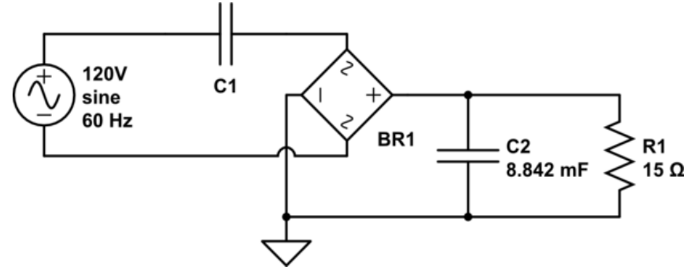
	
***Figura 1.7**: Fuente capacitiva.*
</div>

<div style="text-align: center;">
    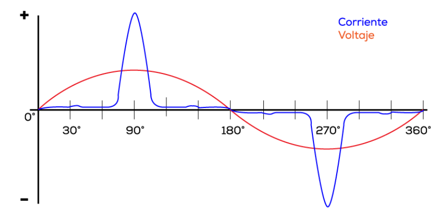
	
***Figura 1.8**: Tensión y corriente de línea (tensión y corriente en el generador de tensión).*
</div>

En este caso, la señal de corriente es no senoidal, pero sigue siendo periódica. Matemáticamente, esto implica que contiene armónicos de Fourier, es decir, componentes frecuenciales que modifican la señal fundamental. La Figura 1.9 ilustra un ejemplo práctico donde se descompone una señal no sinusoidal en la suma de múltiples senoidales con distintas frecuencias, amplitudes y fases, siguiendo la serie de Fourier. Por ejemplo, la frecuencia fundamental b1 tiene una fase y frecuencia diferentes a las del armónico b5.

<div style="text-align: center;">
    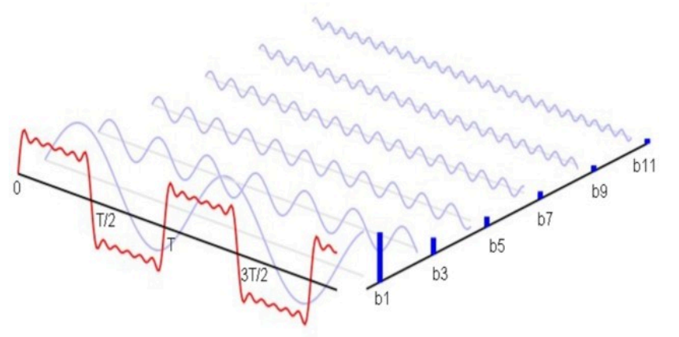
	
***Figura 1.9**: Ejemplo de aplicación de la serie de Fourier, donde se descompone a una señal cuadrada en la suma de múltiples senoidales.*
</div>

Cabe destacar que la frecuencia fundamental es aquella que marca el período de la señal. En el caso de la Figura 1.9, la frecuencia fundamental está determinada por la tensión de red. Aunque la corriente no sea senoidal, su período es el mismo que el de la tensión.

Además, es crucial recordar que el problema de potencia reactiva 𝑄 observado en las cargas LTI (es decir, el desfase entre tensión y corriente) también está presente en las cargas no LTI. Esto se puede observar en la Figura 1.10.

<div style="text-align: center;">
    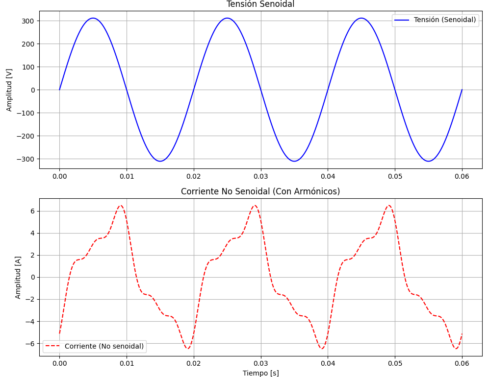
	
***Figura 1.10**: Señal de corriente no senoidal y con energía reactiva en la componente fundamental.*
</div>

Los armónicos se representan en un diagrama espectral, como el mostrado en la Figura 1.11. Este gráfico generalmente es de líneas debido a que la señal es periódica, característica matemática de la transformada de Fourier. Cada armónico tiene una frecuencia que es un múltiplo entero de la frecuencia fundamental.

<div style="text-align: center;">
    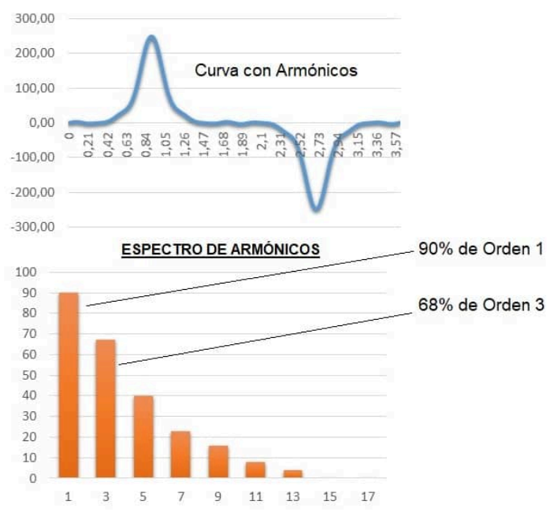
	
***Figura 1.11**: Ejemplo señal módulo de la transformada de Fourier de una señal poli-armónica (corriente de una carga no lineal).*
</div>

#### 1.1.3.2 Medición de armónicos y THD
La potencia de los armónicos se caracteriza mediante el THD (Total Harmonic Distortion). Este índice se calcula como el cociente entre la potencia de los armónicos y la potencia de la componente fundamental:

<div style="text-align: center;">
    <table style="margin: 0 auto;">
        <tr>
            <td>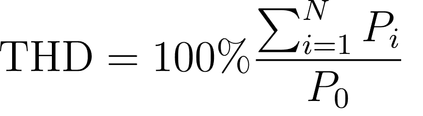</td>
            <td>(1.2)</td>
        </tr>
    </table>
</div>

* Pi: Potencia de cada armónico
* P0: Potencia de la fundamental
* N: Armónicos significativos

Estas potencias pueden relacionarse mediante el triángulo de potencias de la Figura 1.3:
<div style="text-align: center;">
    <table style="margin: 0 auto;">
        <tr>
            <td>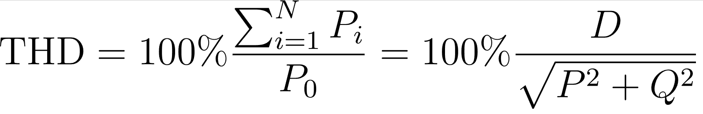</td>
            <td>(1.3)</td>
        </tr>
    </table>
</div>

#### 1.1.3.3 Triángulo de potencias y factor de potencia
La Figura 1.3 muestra el triángulo de potencias completo, que considera todas las potencias en la instalación. La relación entre ellas se calcula mediante el cálculo vectorial, donde la suma de los vectores 𝑃, 𝑄 y 𝐷 resulta en 𝑆:

<div style="text-align: center;">
    <table style="margin: 0 auto;">
        <tr>
            <td>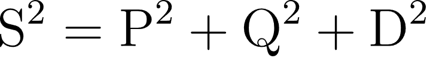</td>
            <td>(1.4)</td>
        </tr>
    </table>
</div>

El factor de potencia (FP) se define como la relación entre P y S:

<div style="text-align: center;">
    <table style="margin: 0 auto;">
        <tr>
            <td>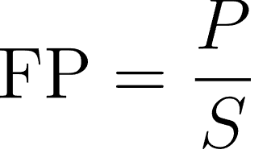</td>
            <td>(1.5)</td>
        </tr>
    </table>
</div>

Este factor de potencia coincide con el coseno del ángulo ϕ cuando la potencia de deformación D es nula.

#### 1.1.3.4 Problemas de la potencia de deformación
Las cargas no LTI, al tener armónicos, presentan varios problemas, entre los cuales destacan:
* Aumento de pérdidas en el transformador: Las pérdidas en el núcleo ferromagnético del * transformador son proporcionales al cuadrado de la frecuencia de la corriente. Esto reduce considerablemente el rendimiento del transformador.
* Interferencias eléctricas: La presencia de frecuencias altas puede generar más ruido eléctrico, interferir con dispositivos que utilizan triacs o SCRs, y dispararlos de manera no deseada.
* Disparo de interruptores diferenciales: Las frecuencias altas también pueden provocar el disparo de interruptores diferenciales sin que haya una verdadera descarga a tierra.

Estos problemas subrayan la importancia de gestionar adecuadamente los armónicos y la potencia de deformación en las instalaciones eléctricas.

## 1.3 Filtro Activo de Armónicos de Corriente

Los filtros activos de armónicos de corriente, también conocidos como compensadores activos, se encargan de mitigar los problemas asociados con las potencias reactiva (Q) y de deformación (D), buscando reducirlas al mínimo posible.

Es importante destacar que tanto las cargas LTI como las no LTI requieren consumir una corriente que naturalmente incluye componentes de potencia reactiva y de deformación. Esto significa que no podemos eliminar estos componentes sin afectar el funcionamiento de las cargas. Por ejemplo, una fuente conmutada necesita realizar la conmutación; no podemos evitar esta conmutación sin comprometer su funcionamiento. Por lo tanto, las fuentes conmutadas inevitablemente consumen armónicos. Mismo razonamiento para cualquier carga no LTI.

Los filtros activos de armónicos de corriente se conectan en paralelo a las cargas, como se muestra en la Figura 1.12. Su objetivo es absorber los armónicos en contrafase (ver Figura 1.13), de manera que, según las leyes de Kirchhoff:

<div style="text-align: center;">
    <table style="margin: 0 auto;">
        <tr>
            <td>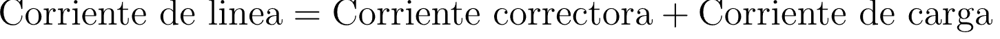</td>
            <td>(1.6)</td>
        </tr>
    </table>
</div>

<div style="text-align: center;">
    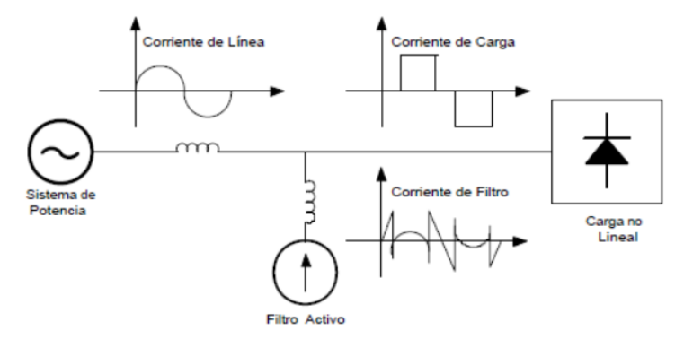
	
***Figura 1.12**: Esquema de conexiones de filtro activo de armónicos de corriente.*
</div>

<div style="text-align: center;">
    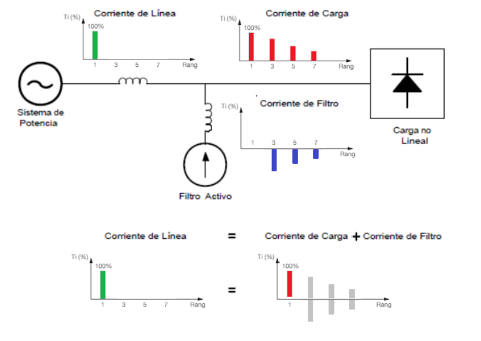
	
***Figura 1.13**: Principio de funcionamiento del filtro activo de armónicos de corriente visto con un enfoque frecuencial.*
</div>

## 1.4 Estado del arte
En el mercado, la mayoría de los compensadores activos son trifásicos debido a que los problemas relacionados con cargas reactivas y armónicos significativos suelen estar asociados con aplicaciones industriales. Ejemplos incluyen máquinas con motores de gran tamaño, variadores de frecuencia, arranques suaves, y fuentes switching de altas potencias.

Varios fabricantes desarrollan este tipo de dispositivos, entre ellos, las empresas Schneider y Circutor, entre otras. Los productos de Circutor, por ejemplo, están equipados con pantallas TFT táctiles que permiten diversas configuraciones (Ver el Anexo 1). Entre las características destacadas se encuentran:
* La capacidad de operar en lazo abierto o en lazo cerrado, dependiendo de la ubicación de las pinzas amperimétricas.
* La opción de compensar o no la potencia reactiva Q. La justificación técnica para esta opción es que, dado que Q generalmente es mucho mayor a D, compensar puede requerir una etapa de potencia significativamente robusta.

## 1.5 DSP
Para el procesamiento digital de señales es importante tener presente algunas estrategias y funcionamiento de algoritmos matemáticos para lograr una correcta performance y aprovechamiento del microcontrolador.

### 1.5.1 DMA
El controlador DMA es el encargado de transportar los datos de los periféricos a la memoria (o viceversa) sin la intervención del procesador. En la Figura 1.14 puede verse un esquema de cómo se utiliza.

<div style="text-align: center;">
    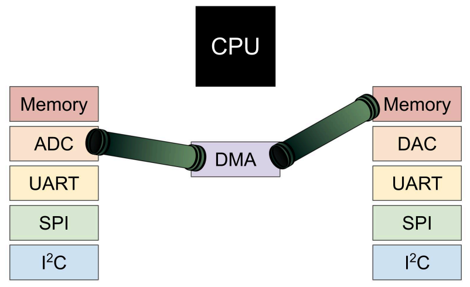
	
***Figura 1.14**: Principio de funcionamiento del controlador DMA.*
</div>

Desde el punto de vista de la implementación, en una línea de código se le da aviso al controlador DMA que empiece una transferencia de datos (por ejemplo 10 datos desde el ADC hasta una posición de memoria) y cuando esta finaliza, se genera un evento que se atiende desde una función callback.

Cuando se realizan proyectos que implican DSP, es decir, procesar una señal en tiempo real, es importante optimizar al máximo el procesador para analizar la señal y minimizar la realización de otras tareas. Por ejemplo, sería una buena idea que las muestras que toma el ADC se almacenen en memoria directamente sin la necesidad de que el procesador se quede esperando a que una muestra esté lista. 


### 1.5.2 FFT
La FFT (Transformada Rápida de Fourier) es un algoritmo que resuelve una DFT (Discrete Fourier Transform). Para su utilización se tiene un vector de entrada y uno de salida de igual longitud. Este algoritmo es de suma utilidad para pasar del dominio temporal al frecuencial y viceversa. Tiene ciertas limitaciones y consideraciones a la hora de implementarlo. Para entender la operatoria y problemas a considerar se desarrolló el Anexo 2, un documento Notebook, en el que se realizan simulaciones con FFT.

# 2 Introducción específica

## 2.1 Requisitos

<div style="text-align: center;">

***Tabla 2.1:** Requisitos que debe cumplir el filtro activo de armónicos de corriente*
</div>

| Grupo de Requerimiento | Requerimiento | Descripción                                                                                                         |
| ---------------------- | ------------- | ------------------------------------------------------------------------------------------------------------------- |
| Aislamiento            | 1.1           | La lógica en todo momento debe estar aislada de la línea de 24 VCA                                                  |
| Sincronización         | 2.1           | El sistema se sincroniza con la línea mediante un detector de ciclos                                                |
| Sensado de corriente   | 3.1           | El sistema deberá tener un filtro anti-alias a la entrada (f0 = 5 kHz).                                             |
| Sensado de corriente   | 3.2           | El ADC tomará muestras de corriente de línea con fs = 20 kHz (Ts = 50 us) por una ventana de 50 ciclos              |
| Salida analógica       | 4.1           | La salida para mostrar la señal correctora será vía DAC                                                             |
| Sistema de buffers     | 5.1           | Se tendrá un esquema double-buffering tanto para tomar muestras como para sacarlas                                  |
| Procesamiento          | 6.1           | Se deberá calcular la componente fundamental de corriente                                                           |
| Procesamiento          | 6.2           | Se debe conseguir la "forma de onda correctora" haciendo la resta entre la fundamental y la señal leída             |
| Procesamiento          | 6.3           | El sistema debe corregir en régimen permanente (No importa si el procesamiento / muestreo es lento)                 |
| Display                | 7.1           | En el display de caracteres LCD se mostrará THD de la señal de entrada                                              |
| Testeo                 | 8.1           | Para testear el sistema se deberá verificar con la operación “math” del osciloscopio la validez de la ecuación 1.5. |

## 2.2 Casos de uso

<div style="text-align: center;">

***Tabla 2.2:** Caso de uso procesamiento*
</div>

| Caso de uso       | Procesamiento de señal                                                                                                                                                                                                                          |
| ----------------- | ----------------------------------------------------------------------------------------------------------------------------------------------------------------------------------------------------------------------------------------------- |
| Disparador        | El ADC recupera 50 ciclos                                                                                                                                                                                                                       |
| Precondición      | Sistema configurado para corregir                                                                                                                                                                                                               |
| Flujo normal      | *   Se hace una conmutación de buffers en el double buffering|
|                   | *   Se procesa la señal para obtener la señal fundamental |
|                   | *   Se obtiene el THD
|                   | *   Se actualiza display
|                   | *   Se calcula la señal correctora y se saca por DAC |
| Flujo alternativo | Se sigue esperando a que se complete el muestreo         


<div style="text-align: center;">

***Tabla 2.2:** Caso de uso display*
</div>

| Caso de uso       | Display                               |
| ----------------- | ------------------------------------- |
| Disparador        | Llamen a la función “updateDisplay()” |
| Precondición      | Que se haya inicializado el display   |
| Flujo normal      | Actualiza valor de THD mostrado       |
| Flujo alternativo | No cambia lo mostrado en la pantalla  |

## 2.4 Kit de Desarrollo STM32 Nucleo-F429ZI
Para la implementación de la solución se utiliza un kit de desarrollo STM32 Nucleo-F429ZI. El microcontrolador del kit es lo suficientemente potente como para realizar todas las operaciones DSP en un tiempo razonable. En el Anexo 3 se adjunta la hoja de datos y reference manual del microcontrolador.

## 2.5 Biblioteca de ARM CMSIS - DSP
Debido a que hay que realizar operaciones matemáticas y de una complejidad considerable, es importante hacer un uso eficiente del procesador. Para lo cual, es necesario la utilización de la biblioteca CMSIS-DSP, esta es la biblioteca oficial de ARM para hacer un uso eficiente de la ALU y unidad DSP del microcontrolador.
	
Esto significa que esta librería utiliza las instrucciones assembler de manera optimizada para conseguir el resultado deseado en la menor cantidad de tiempo posible. Su uso es muy importante para no sobrecargar al procesador.
	
Esta biblioteca es del tipo estática, es decir, no se tiene acceso al código fuente, pero sí a su archivo cabecera y documentación para entender cómo utilizarla. En el anexo 4 se adjunta el enlace a la página oficial.

## 2.6 STM32Cube IDE
Como IDE de desarrollo se utilizó el STM32Cube IDE ya que brinda más facilidades a la hora de configurar periféricos específicos del microcontrolador utilizado, por ejemplo el controlador DMA o la inclusión de bibliotecas estáticas. En el Anexo 5 se adjunta el enlace al sitio oficial.

## 2.7 Sensor de corriente ACS712-5A
Para implementar la medición de corriente se utiliza un sensor ACS712-5A (en el Anexo 6 se adjunta la hoja de datos). Este es un sensor de corriente por efecto Hall que entrega una tensión proporcional a la corriente que circula entre los bornes “P+” y “P-” (“Load +” y “Load -”). Cabe destacar que este sensor tiene aislada la etapa de entrada de la etapa de salida. En la Figura 2.1 puede verse el chip ACS712-5A. Este sensor permite la medición de corrientes de +/- 5 A. Su alimentación es de 5V y tiene una sensibilidad de 180 mV/A.

<div style="text-align: center;">
    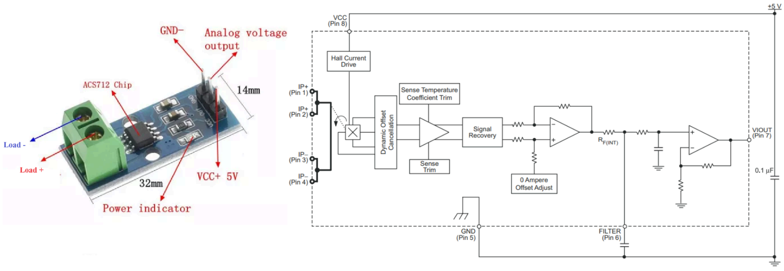

***Figura 2.1:** Sensor de corriente ACS712 - 5A.*
</div>

# 3 Diseño e implementación

## 3.1 Hardware del filtro activo de armónicos de corriente

### 3.1.1 Diagrama en bloques general
En la Figura 3.1 se puede ver el diagrama en bloques general de la solución. Cabe destacar que en esta primera instancia de desarrollo se va a resolver el procesamiento exclusivamente, por eso es que no está en el diagrama en bloques la etapa de potencia (etapa que inyecta corriente).

<div style="text-align: center;">
    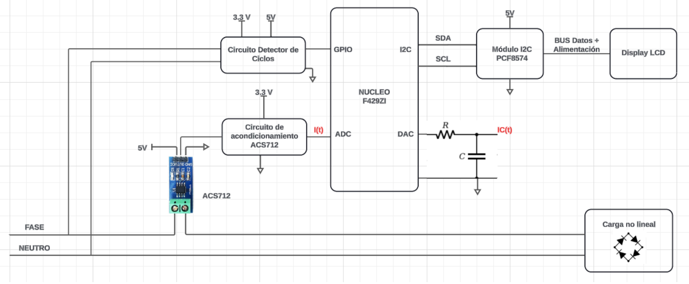

***Figura 3.1:** Diagrama en bloques del Hardware.*
</div>

### 3.1.2 Entrada de fase y neutro
La entrada de fase y neutro en este proyecto es una tensión senoidal de 9 VAC. Para ello se utiliza un transformador de 220 V a 9 V. En la Figura 3.2 puede verse una imagen representativa.

<div style="text-align: center;">
    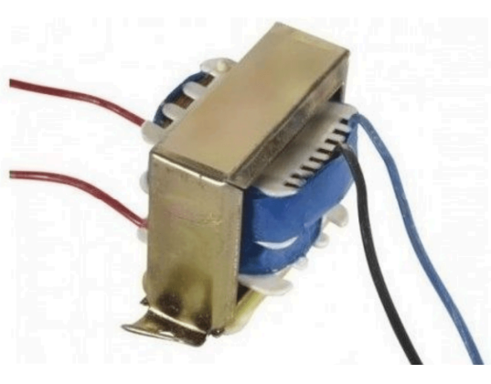

***Figura 3.2:** Imagen de un transformador.*
</div>

### 3.1.3 Detector de ciclos
Se propone un esquema como el de la Figura 3.3. Este es un circuito encargado de detectar los ciclos de la tensión senoidal de entrada. En este caso, la tensión entre fase y neutro. El circuito entrega debe entregar 3.3 V cuando el semiciclo es positivo y 0 V cuando el semiciclo es negativo.

<div style="text-align: center;">
    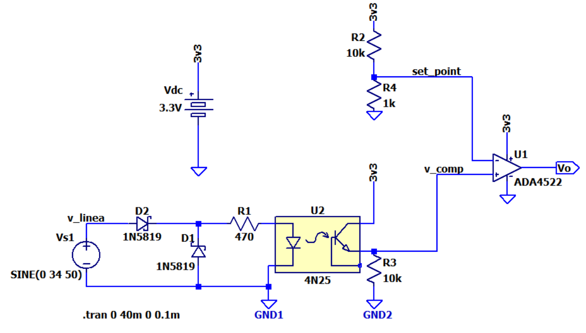

***Figura 3.3:** Circuito detector de ciclos.*
</div>

Cabe destacar que el optoacoplador está preparado para trabajar con señales senoidales con rectificación de onda completa, por lo que su tensión inversa máxima es de 5 V. Por eso es que se hizo el arreglo de diodos D1 y D2 para limitar la tensión aplicada sobre el led de U2.
En la Figura 3.4 se puede ver una simulación del circuito.

<div style="text-align: center;">
    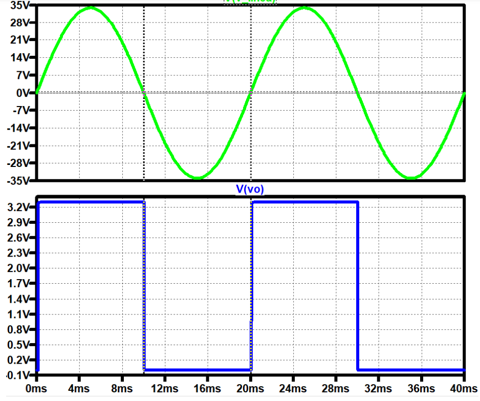

***Figura 3.4:** Simulación del circuito detector de ciclos.**
</div>

### 3.1.4 Acondicionamiento del sensor de corriente
El sensor de corriente, si bien ya está acondicionado por el fabricante, hay que re-acondicionar la señal para que la señal de salida tenga una excursión de 0 V a 3.3 V (no hasta 5 V como viene de fábrica). Para ello se propone un circuito como el de la Figura 3.5.

<div style="text-align: center;">
    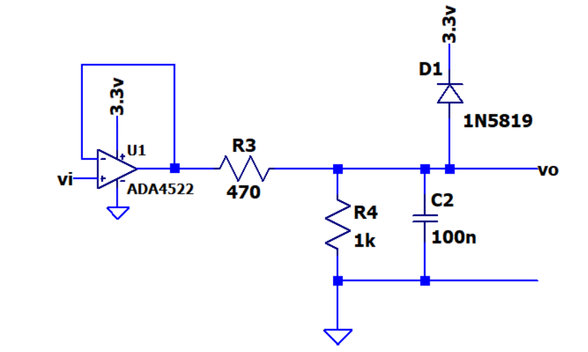

***Figura 3.5:** Circuito de acondicionamiento del sensor de corriente.*
</div>

En esta etapa además de ajustar el rango dinámico de la señal de salida, se añade el filtro antialias conformado por las resistencias y el capacitor. Por otro lado, a modo de protección se añade el diodo de clamp D1.
Finalmente, en las Figuras 3.6 y 3.7 se adjuntan las simulaciones temporales y frecuenciales, respectivamente.

<div style="text-align: center;">
    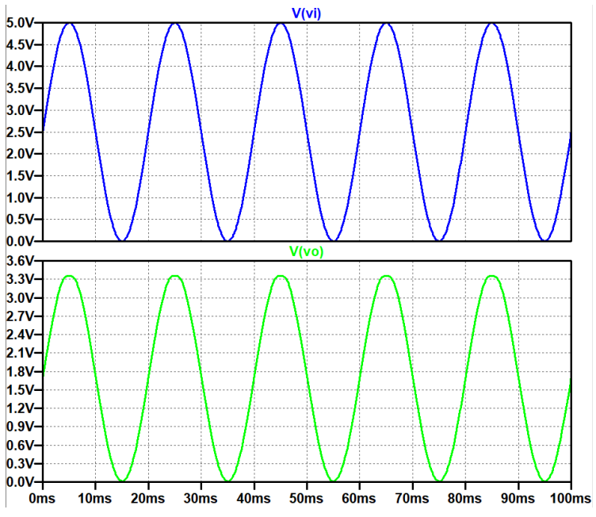

***Figura 3.6:** Simulación del ajuste de las tensiones del acondicionamiento del sensor de corriente; Vi = 5 V, Vo = 3.3 Vp.*
</div>

<div style="text-align: center;">
    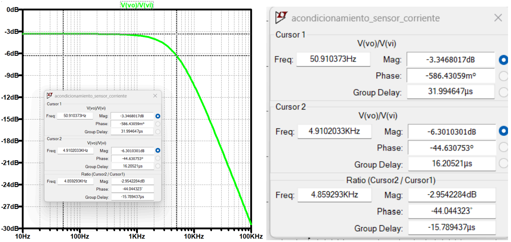

***Figura 3.7:** Respuesta en frecuencia del filtro F0 = 5 kHz.**
</div>

### 3.1.5 Display
Como interfaz de usuario para el monitoreo se utiliza un Display de caracteres LCD de 4x20 caracteres controlado por una interfaz I2C PCF8574. En la Figura 3.8 se muestra un ejemplar.

<div style="text-align: center;">
    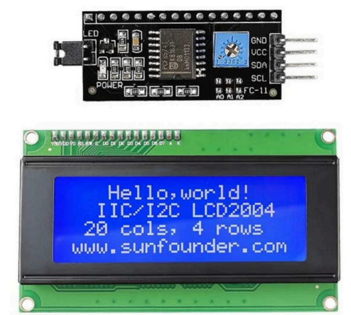

***Figura 3.8:** Display de caracteres LCD 4x20 con controlador adaptador I2C-Paralelo PCF8574.*
</div>

### 3.1.6 Filtro de interpolación
Para filtrar la cuantización del DAC se utiliza un filtro de interpolación (filtro pasa bajos) como el de la Figura 3.9.
Para el diseño se utiliza F0 = 30 kHz por lo se utilizaron una resistencia de 470 Ω y un capacitor de 100 nF

<div style="text-align: center;">
    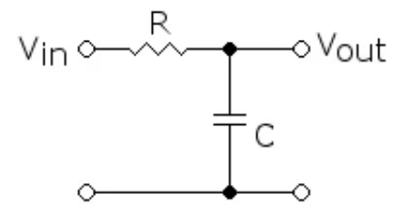

***Figura 3.9:** Filtro de interpolación.*
</div>

## 3.2 Firmware del filtro activo de armónicos de corriente

### 3.2.1 Modularización y capas de software

En la Figura 3.10 se puede ver un diagrama de la modularización propuesta para la solución.

<div style="text-align: center;">
    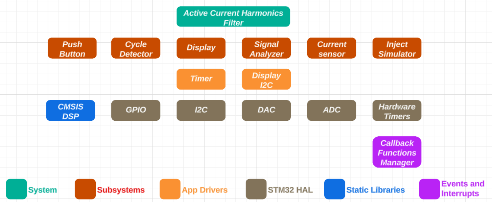

***Figura 3.10:** Diagrama: modularización y capas de software.*
</div>

Por otro lado, en la Figura 3.11 se puede ver la división en directorios de la solución de firmware.

```
/sources/Core/Src/
|-- main.c
|-- active_current_harmonics_filter/
|   |-- active_current_harmonics_filter.c
|   |-- active_current_harmonics_filter.h
|   |-- callback_functions_manager.c
|   |
|   |-- subsystems/
|   |   |-- push_button/
|   |   |   |-- push_button.c
|   |   |   |-- push_button.h
|   |   |
|   |   |-- cycle_detector/
|   |   |   |-- cycle_detector.c
|   |   |   |-- cycle_detector.h
|   |   |
|   |   |-- display/
|   |   |   |-- display.c
|   |   |   |-- display.h
|   |   |
|   |   |-- signal_analyzer/
|   |   |   |-- signal_analyzer.c
|   |   |   |-- signal_analyzer.h
|   |   |
|   |   |-- current_sensor/
|   |   |   |-- current_sensor.c
|   |   |   |-- current_sensor.h
|   |   |
|   |   |-- inject_simulator/
|   |   |   |-- inject_simulator.c 
|   |   |   |-- inject_simulator.h
|   |   |
|   |-- drivers/
|   |   |-- display_i2c/
|   |   |   |-- display_i2c.c
|   |   |   |-- display_i2c.h
|   |   |
|   |   | -- timer_driver/
|   |   |   |-- timer_driver.c
|   |   |   |-- timer_driver.h
|   |
|   |-- libraries/
|   |   |-- CMSIS_DSP/
```

<div style="text-align: center;">

***Figura 3.11:** Estructura de directorios: modularización y capas de software*
</div>

En las siguientes secciones se desarrollarán las máquinas de estados y módulos más importantes de la solución.

### 3.2.2 active_current_harmonics_filter

El módulo “active_current_harmonics_filter” es el sistema principal de la solución. Este contiene la máquina de estados general, encargada de inicializar el sistema con una calibración, administrar los modos de trabajo “working” (formado por los estados “SAMPLING”, “PROCESSING” y “WAITING_SETTING_TIME”) y “stand by” (formado por el estado “STAND_BY”). En la Figura 3.12 puede verse el diagrama.

<div style="text-align: center;">
    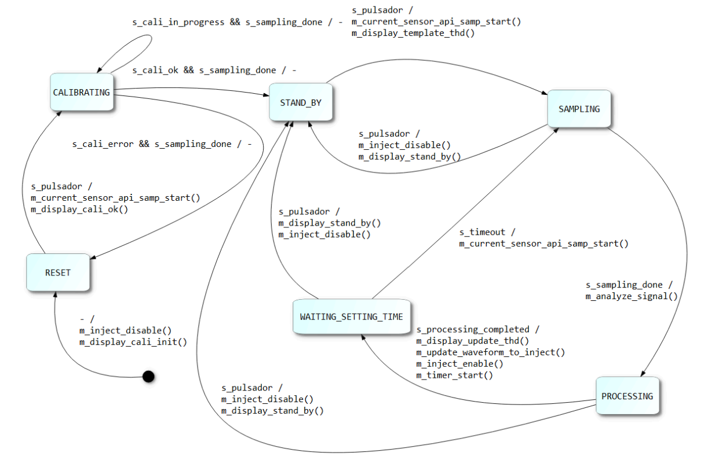

***Figura 3.12:**  Máquina de estados de “active_current_harmonics_filter”*
</div>

Para comenzar, el sistema pide hacer una calibración, es decir, determinar el valor del sensor de corriente cuando no hay corriente. Para ello, mediante el display, se le va a pedir al usuario que desconecte todas las cargas y que presione el pulsador.  En este punto se le pide a “current_sensor” que inicie un proceso de muestreo. Cuando termina el proceso de muestreo, se analiza qué tanta variabilidad tuvieron las muestras. Si la variabilidad es baja se toma como calibración exitosa y se guarda el valor de la calibración (en caso de que haya salido mal, se le informa al usuario que debe hacer un reintento).

Una vez realizada la calibración, se pasa al estado de stand by, es decir, el sistema está listo para ser utilizado. Para que el sistema continúe con el proceso se debe presionar el pulsador.

Una vez presionado el pulsador, entra en el “modo working”. Este modo es el ciclo de trabajo formado por los estados “sampling”, “processing” y “waiting_setting_time”. El “modo working” utiliza una un principio de funcionamiento en el que aprovecha que las señales del sistema son periódicas y está pensado para trabajar en régimen permanente. 

Esto último permite no tener restricción de tiempo para el procesamiento. La filosofía de trabajo es que el módulo “inject_simulator” empiece a inyectar la última señal configurada cada vez que llegue un nuevo ciclo (el encargado de notificar cuándo empieza un nuevo ciclo es “cycle_detector”). De esta manera, el procesador puede trabajar sin la necesidad de estar pendiente de cuánto tiempo tarda el procesamiento.

Entonces el ciclo de trabajo que se realiza en “modo working” es:
* SAMPLING: Tomar una muestra de una determinada cantidad de ciclos. Para esto se usa la “current_sensor”, quien retorna un ciclo promedio que sea representativo de la señal leída.
* PROCESSING: Se le envía este ciclo promedio a “signal_analyzer”. Esta retorna el valor de THD medido y la forma de onda de la señal a inyectar. En este punto, la “active_current_harmonics_filter” le actualiza la forma de onda que tiene que inyectar a “inject_simulator”.
* WAITING_SETTING_TIME: Se espera un tiempo de establecimiento del orden de los segundos.

Cabe destacar que esta filosofía de trabajo no es eficiente para cargas que varían rápidamente en el tiempo. Para que funcione de manera adecuada las cargas deben variar con un período mayor a 5 segundos (tiempo correspondiente a la realización de un ciclo de “working”).

### 3.2.3 current_sensor
Esta es la API tiene dos objetivos principales.
* Ciclo promedio: Retornar un ciclo de la señal de corriente que está midiendo. Para eso debe procesarse la señal que adquirió el ADC.
* Calibración: Analizar si la muestra captada por el ADC tiene poca variabilidad, de tal manera que sea apta para hacer una calibración. En caso de ser una muestra apta, retornar el valor de la calibración.
	
Por lo tanto, esta API tendrá funciones específicas para dar comienzo al muestreo, chequear el estado del muestreo, evaluar las muestras tomadas por si se quiso hacer una calibración y evaluar las muestras tomadas para retornar el ciclo promedio.
	
En la Figura 3.13 se muestra la máquina de estados correspondiente al proceso de tomar muestras hasta llenar el buffer.

<div style="text-align: center;">
    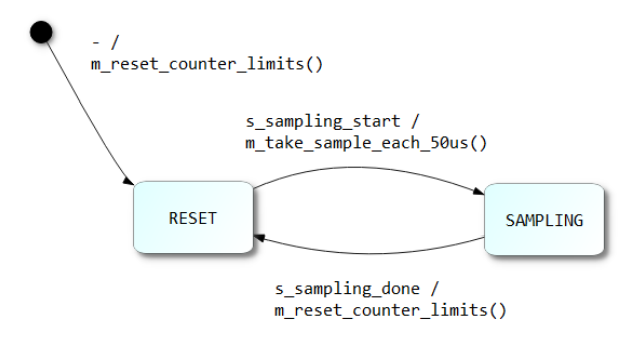

***Figura 3.13:**  Máquina de estados de “current_sensor”.*
</div>

Cada vez que otra se le dé la orden de empezar a tomar muestras pasará al estado SAMPLING en el que tomará una muestra cada cierto tiempo. Una vez que se llene por completo el buffer retornará al estado de reset.

Cabe destacar que en el reset se “reinicia contador de límites” porque dentro del estado de SAMPLING lleva un registro de entre qué índices del vector de muestras hay contenido un ciclo de la red eléctrica.

### 3.2.4 signal_analyzer
Este módulo tiene dos objetivos principales:
* Obtener el THD de la señal que se le pase como argumento
* Obtener cuál es la señal que se debería inyectar para quitarle los armónicos a la señal que se le pase como argumento.
Para cumplir con este objetivo, se toma la señal “ciclo promedio” que capturó el módulo encargado de leer el sensor de corriente. A tal fin hay una función dentro de la API que permite setear este ciclo promedio.

### 3.2.5 display
Este módulo se encarga de escribir los mensajes en el display. Para ello, tiene diferentes funciones para mostrar en pantalla el mensaje deseado.


### 3.2.6 inject_simulator
Este módulo se encarga de actualizar el valor de tensión de salida del DAC. Este módulo tiene configurado el vector se debe inyectar en el DAC cada vez que inicie un nuevo ciclo.

Para cumplir con el objetivo, se diseñó la máquina de estados de la Figura 3.14. Esta contempla diferentes casos y permite la deshabilitación o habilitación del proceso de inyección.

<div style="text-align: center;">
    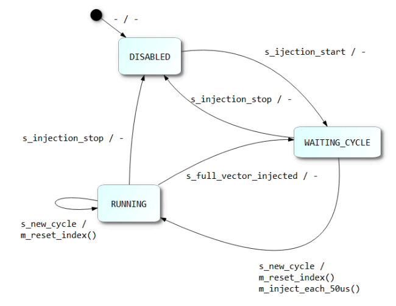

***Figura 3.14:** Máquina de estados de “inject_simulator”.*
</div>

El nombre del módulo es “inject_simulator”, dado que en verdad no inyecta corriente sino que hace una simulación de inyección con el DAC, es decir, entrega una tensión que tiene la misma forma de onda que la corriente que se debería inyectar para corregir los armónicos.

### 3.2.7 cycle_detector

Se encarga de dar aviso a los slots del resto de aplicaciones que necesiten hacer uso del detector de ciclos. Por otro lado, se encarga de validar si la interrupción recibida es coherente. 

Por ejemplo, los ciclos tienen una duración de 20 ms en Argentina (50 Hz), por lo tanto, ignora todas aquellas interrupciones que estén por fuera de un rango razonable. Es decir, hace una validación similar a la rutina anti-rebote de los pulsadores.
Este módulo además estima la frecuencia de línea que están marcando los inicios de ciclo.

# 4 Ensayos y resultados

## 4.1 Prototipo
En la Figura 4.1 se puede ver una imagen del prototipo conseguido y en la Figura 4.2 un contraste con el diagrama en bloques general identificando cada una de las partes principales.

<div style="text-align: center;">
    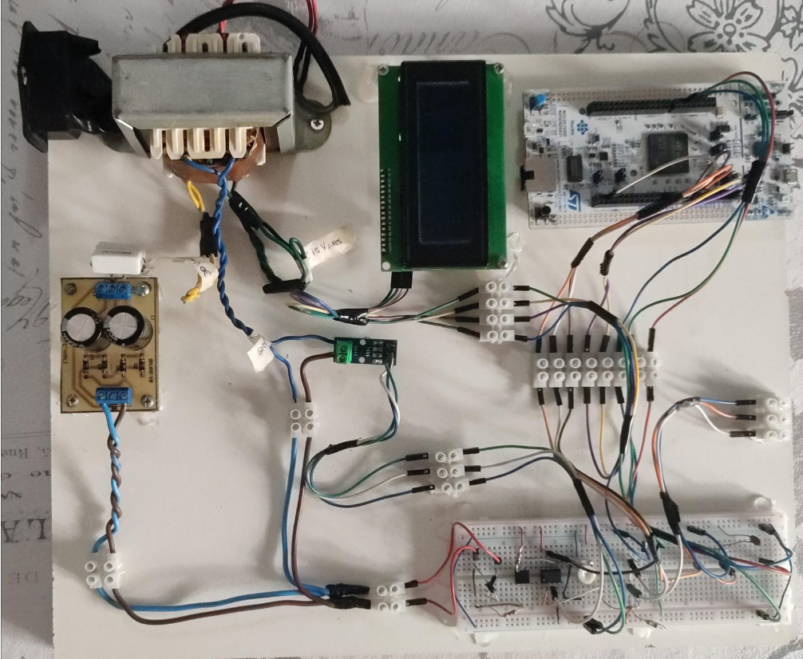

***Figura 4.1:** Prototipo conseguido.*
</div>

<div style="text-align: center;">
    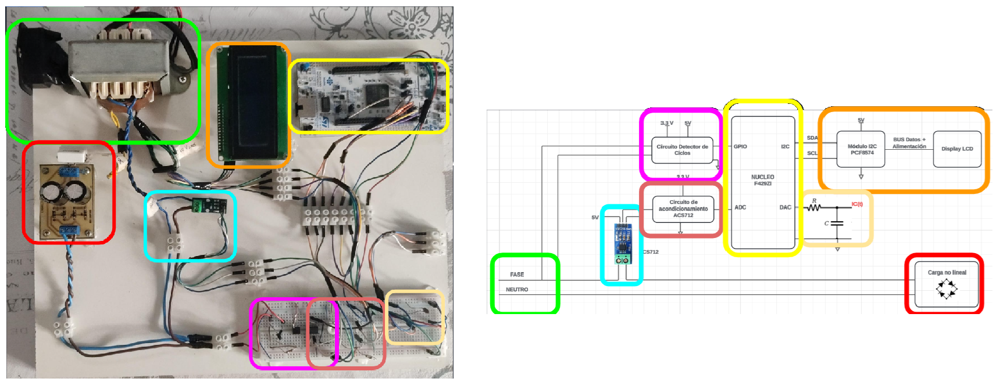

***Figura 4.2:** Identificación de las partes principales en el prototipo.*
</div>


## 4.2 Pruebas funcionales del hardware

### 4.2.1 Circuito detector de ciclos
En la Figura 4.3 puede verse el oscilograma correspondiente al detector de ciclos y la señal de entrada.

Se puede observar que el tiempo de delay del circuito es de aproximadamente 500 μs.

<div style="text-align: center;">
    

***Figura 4.3:** CH1 tensión de red y CH2 salida del detector de ciclos.*
</div>

### 4.2.2 Acondicionamiento sensor de corriente
En la Figura 4.4 puede verse un oscilograma con la entrada y salida de la etapa de acondicionamiento.

Recordando, la salida del sensor de corriente se conecta a este bloque de acondicionamiento. Esta señal acondicionada es la que se conecta con el microcontrolador.

Se puede observar que la relación entre amplitudes es la correcta.

<div style="text-align: center;">
    

***Figura 4.4:** CH1 entrada del circuito de acondicionamiento (salida del sensor de corriente), CH2 señal de salida del circuito de acondicionamiento.*
</div>

## 4.3 Pruebas funcionales del firmware

### 4.3.1 current_sensor

En la Figura 4.5 se observa el ploteo de los primeros 5 ciclos de la señal adquirida con el ADC. Como se puede observar la señal es muy ruidosa y tiene muchos glitches. Por eso es necesario aplicar un filtrado antes de procesarla. En este caso particular se optó hacer un promediado similar a la función "average" del osciloscopio.

<div style="text-align: center;">
    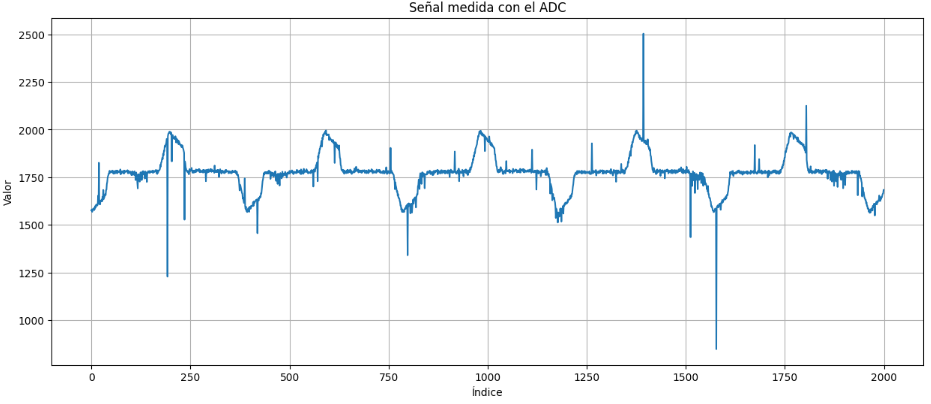

***Figura 4.5:** Señal adquirida con el ADC con FS = 20 kHz.*
</div>

En la Figura 4.6 se observa el ciclo promedio obtenido a partir del análisis de dicha señal.

<div style="text-align: center;">
    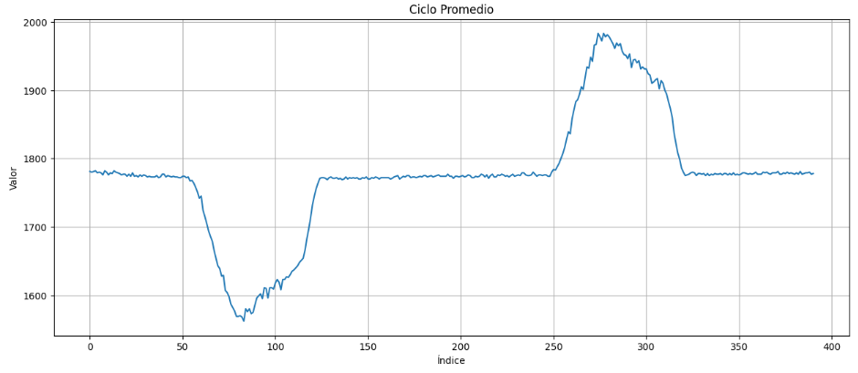

***Figura 4.6:** Ciclo promedio.*
</div>

### 4.3.2 signal_analyzer
En el Anexo 7 se adjunta un Notebook donde se analizan las señales obtenidas con el microcontrolador y una comparación con una simulación computacional hecha con Python. En resumen, los resultados obtenidos con el microcontrolador son muy similares a los calculados en la simulación.

### 4.3.3 display
Para verificar el correcto funcionamiento, se probaron los diferentes mensajes que la aplicación necesita. Por ejemplo, en la Figura 4.7 uno de ellos.

<div style="text-align: center;">
    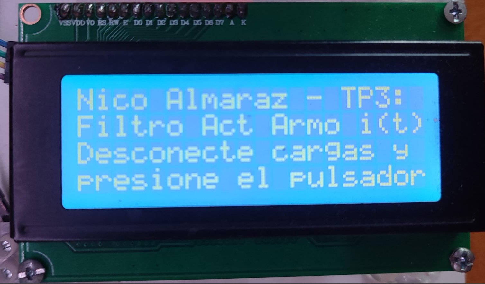

***Figura 4.7:** Pantalla para iniciar calibración.*
</div>

### 4.3.4 inject_simulator

Para verificar el correcto funcionamiento de este módulo, se introdujo como señal a inyectar una señal triangular conocida y se verificó el correcto funcionamiento con el osciloscopio. Esto podemos verlo en la Figura 4.8. Cabe destacar que las transiciones de alta frecuencia se vieron afectadas por el filtro de interpolación.

<div style="text-align: center;">
    

***Figura 4.8:** Señal triangular generada para probar el módulo “inject_simulator”.*
</div>

## 4.4 Pruebas de integración
Para verificar el correcto funcionamiento se busca probar la verificación de la ecuación 1.5. Para ello se tomaron los oscilogramas de entrada (sensor de corriente, CH1) y salida (señal a inyectar, CH2) y luego se hace la suma de ambas señales para recuperar la corriente de línea (Canal Math CH1+CH2). Todo esto se puede observar en la Figura 4.9.

Cabe destacar que como canal adicional se pone la señal cuadrada que es el detector de ciclos. Puede verse que la señal senoidal queda en fase con el inicio y fin de los ciclos de la red. Esto significa que la señal está correctamente sincronizada con la red eléctrica (componente Q reducida). 

<div style="text-align: center;">
    

***Figura 4.9:** Prueba de funcionamiento integral.*
</div>

Como se puede ver la señal es una senoidal pura.

Para más información puede revisarse el Anexo 8 que contiene el repositorio con el código de implementación y su respectiva documentación generada con Doxygen donde se explica en detalle cada parte del código. Por ejemplo, funciones, estructuras, defines, etc.
En este mismo anexo, también hay un video donde se muestra el funcionamiento del sistema. 


## 4.5 Cumplimiento de requisitos

<div style="text-align: center;">

***Tabla 4.1:** Cumplimiento de los requisitos.*
</div>

| Grupo de Requerimiento | Requerimiento | Descripción                                                                                                         | Cumplimiento                                                                         |
| ---------------------- | ------------- | ------------------------------------------------------------------------------------------------------------------- | ------------------------------------------------------------------------------------ |
| Aislamiento            | 1.1           | La lógica en todo momento debe estar aislada de la línea de 24 VCA                                                  | Sí                                                                                   |
| Sincronización         | 2.1           | El sistema se sincroniza con la línea mediante un detector de ciclos                                                | Sí                                                                                   |
| Sensado de corriente   | 3.1           | El sistema deberá tener un filtro anti-alias a la entrada (f0 = 5 kHz).                                             | Sí                                                                                   |
| Sensado de corriente   | 3.2           | El ADC tomará muestras de corriente de línea con fs = 20 kHz (Ts = 50 us) por una ventana de 50 ciclos              | Sí                                                                                   |
| Salida analógica       | 4.1           | La salida para mostrar la señal correctora será vía DAC                                                             | Sí                                                                                   |
| Sistema de buffers     | 5.1           | Se tendrá un esquema double-buffering tanto para tomar muestras como para sacarlas                                  | No, se utiliza un método alternativo más limitado pero cumple con el objetivo del TP |
| Procesamiento          | 6.1           | Se deberá calcular la componente fundamental de corriente                                                           | Sí                                                                                   |
| Procesamiento          | 6.2           | Se debe conseguir la "forma de onda correctora" según lo explicado en el capítulo 1.                                | Sí                                                                                   |
| Procesamiento          | 6.3           | El sistema debe corregir en régimen permanente (No importa si el procesamiento / muestreo es lento).                | Sí                                                                                   |
| Display                | 7.1           | En el display de caracteres LCD se mostrará THD de la señal de entrada.                                             | Sí                                                                                   |
| Testeo                 | 8.1           | Para testear el sistema se deberá verificar con la operación “math” del osciloscopio la validez de la ecuación 1.5. | Sí                                                                                   |


# 5 Conclusiones

## 5.1 Resultados obtenidos
El resultado obtenido se considera exitoso porque cumplió con los objetivos principales:
* Medir y procesar la señal de corriente correctamente.
* Simular una inyección de corriente a la red eléctrica.
* Asegurar una sólida base para continuar el desarrollo de la asignatura Electrónica de Potencia en UTN FRBA.

## 5.2 Próximos pasos
La próxima etapa de desarrollo es el control de la etapa de potencia, es decir, cambiar el módulo “inject_simulator” por el módulo “current_injector”. Este deberá encargarse de inyectar el ciclo deseado en la red eléctrica.

En este punto se abren varias decisiones, por ejemplo, si trabajar a lazo abierto como se plantea hasta ahora o implementar un lazo de control que realimente la corriente de la red para hacerla lo más senoidal posible.

# 6 Bibliografía
[1]  Schneider (2024, Sep 12). Schneider Electric [Online]. Disponible en: https://www.se.com/ar/es/ 

[2] Circutor (2024, Sep 12). Circutor [Online]. Disponible en: https://circutor.com/ 

[3]  Anumaka, M.C. (2012) 'Analysis of Electric Circuits Using Fourier Series', International Journal of Engineering and Innovative Technology (IJEIT), 1(5), pp. 146–150. ISSN: 2277-3754.. Disponible en: https://ahsheikh.github.io/Courses/CompMethods/LectureNotes/Fourier_Circuit.pdf111

# 7 Anexos

## Anexo 1: Review de productos Circutor

En el siguiente enlace se encuentra un video con un análisis de configuración y funcionalidades de un compensador de la firma Circutor: 

<a href="https://www.youtube.com/watch?v=owPMb1Tr1OI&ab_channel=Circutor">
  
</a>

## Anexo 2: Notebook FFT
En el siguiente enlace se encuentra un Notebook haciendo uso de la función FFT explicando sus limitaciones y cuidados frente al Spectral Leakage:
[Anexo 2](https://github.com/NicolasTobiasAlmaraz/filtro_activo_armonicos_corriente/blob/main/Notebooks/anexo2.ipynb)


## Anexo 3: STM32 F429ZI
En el siguiente enlace se encuentra el reference manual, data sheets y notas de aplicación relacionadas al microcontrolador y la placa Nucleo: https://www.st.com/en/evaluation-tools/nucleo-f429zi.html#documentation

## Anexo 4: Biblioteca CMSIS-DSP
En el siguiente enlace se encuentra la el manual de referencia oficial de la biblioteca CMSIS-DSP: https://arm-software.github.io/CMSIS_5/DSP/html/index.html 

En este otro enlace se encuentra el repositorio oficial de la biblioteca CMSIS-DSP desde donde puede descargare: https://github.com/ARM-software/CMSIS-DSP 

## Anexo 5: STM32Cube IDE
En el siguiente enlace se encuentra el sitio oficial de ST Electronics con el IDE oficial para sus microcontroladores STM32Cube IDE: https://www.st.com/en/development-tools/stm32cubeide.html 

## Anexo 6: ACS712-5A
En el siguiente enlace se encuentra el enlace a la hoja de datos del sensor ACS712-5A: https://www.sparkfun.com/datasheets/BreakoutBoards/0712.pdf 

## Anexo 7: Validación del módulo de firmware signal_analyzer
En el siguiente enlace se encuentra un Notebook con una verificación de lo que se procesa en current_sensro y signal_analyzer:
[Anexo 7](https://github.com/NicolasTobiasAlmaraz/filtro_activo_armonicos_corriente/blob/main/Notebooks/anexo7.ipynb)

## Anexo 8: Códigos fuente y Documentación
*Códigos fuente:* [Códigos Fuente](https://github.com/NicolasTobiasAlmaraz/filtro_activo_armonicos_corriente/tree/main/Sources)

*Documentación del código fuente:* [Documentación Doxygen](https://rawcdn.githack.com/NicolasTobiasAlmaraz/filtro_activo_armonicos_corriente/50b7d0af559790f539d4cfe7f90ac27d37ef2cf7/Doc%20Firmware/html/index.html)

*Video de Funcionamiento:*

<a href="https://www.youtube.com/watch?v=SaUtxi-bsFg&t=262s&ab_channel=NicolasAlmaraz">
  
</a>
