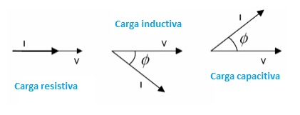
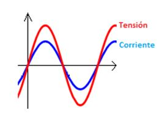
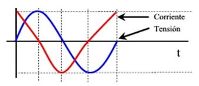
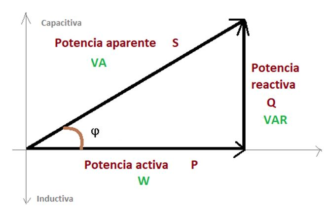
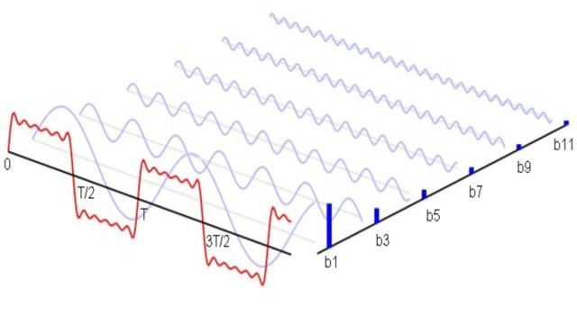
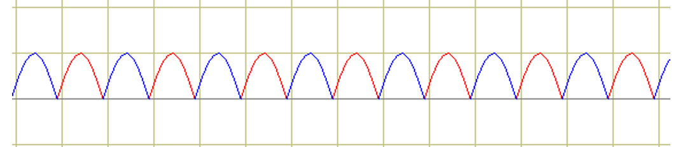
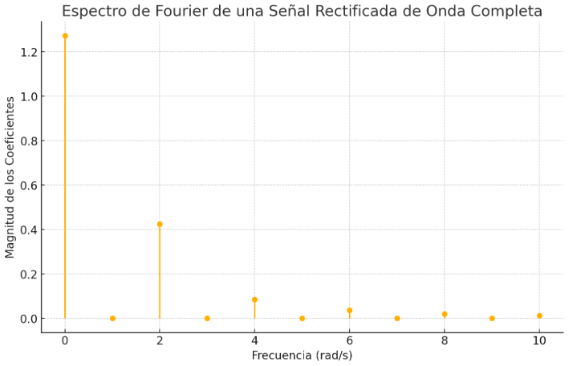
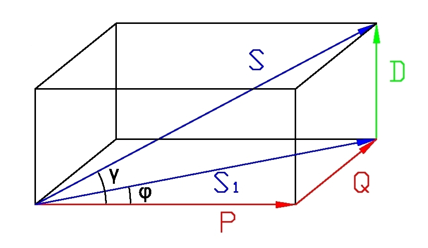

# Filtro Activo de Armónicos de Corriente

## TP Final - Curso Sistemas Embebidos

### Alumno:
Nicolás Almaraz - nnico.almaraz@gmail.com

### Profesores: 
- Ariel Lutenberg
- Segio Caprile
- Juan Manuel Reta
- Eduardo Filomena

## Video del Funcionamiento
TODO: link

## Video del Funcionamiento
TODO: link

## Estructura de archivos fuente
```
/sources
|-- main.cpp
|-- dir1
| |-- src1.h
| |-- src1.cpp
|-- dir2
| |-- src2.h
| |-- src2.cpp
|-- dir3
| |-- dir3.h
| |-- dir3.cpp
|-- app
| |-- app.h
| |-- app.cpp
```

## Documentación
En la carpeta "doc/html" está el archivo "index.html" que contiene la documentación generada con Doxygen del proyecto completo.

## Objetivo:
Eliminar armónicos de corriente por inyección en contrafase de una línea de tensión de 24VAC

## Descripcion
En el presente trabajo práctico se presenta un controlador para un filtro activo de armónicos de corriente para una línea de 24VAC.

Este trabajo práctico será utilizado en un trabajo más grande correspondiente a la asignatura Electrónica de Potencia en UTN FRBA.

El objetivo será desarrollar el controlador de circuito que inyecte corriente en la línea con el fin de eliminar armónicos de corriente indeseados.

En otras palabras, se va a inyectar a la línea armónicos de corriente en contrafase de tal manera que solamente quede la componente fundametal de corriente 50Hz

El diseño de hardware no es únicamente de mí autoría. También participaron los estudiantes de UTN FRBA (Barral Federico, Glorioso Guido, Nahum Axel y Palozzo Santiago).

## Marco teórico
### Sistemas lineales e invariantes en el tiempo (SLIT) exitados por una senoidal
En este tipo de sistemas tenemos tres tipos de cargas.
- Resistivas
- Inductivas
- Capacitivas
Las resistivas tienen tensión en fase con corriente

Las capacitivas tienen corriente adelantada a tensión

Las inductivas tienen tensión adelantada a corriente



#### Resistivas
Tensión en fase con corriente

Consumen potencia activa (energía en forma de calor)



#### Inductivas
Tensión tensión adelanta a corriente

Consumen potenia reactiva positiva


#### Capacitivas
Corriente adelanta a tensión

Consumen potenia reactiva positiva



#### Potencias y coseno Fi
##### Potencia activa P
Las caragas resistivas consumen potencia activa exclusivamente, es decir, energía en forma de calor por cada ciclo.

##### Potencia reactiva Q
Las caragas reactivas (capacitores e inductores) consumen potencia reactia exclusivamente, es decir, energía que  no puede ser utilizada para generar un trabajo.

##### Potencia aparente S
La suma cuadrática de ambas potencias forma la potencia aparente.

##### Coseno Fi
Se le conoce cos(fi) al ángulo entre la potencia activa y potencia aparente.

En general siempre se busca tener potencia activa, dado que es la única potencia capaz de generar un trabajo mecánico.

Por eso en una línea eléctrica se requiere que cos(fi) = 1 idealmente, es decir, S=P



### Cargas No Lineales exitadas por una senoidal y factor de potencia
Cuando se trabajan con cargas no lineales, lo que ocurre a diferencia de los SLIT es que si exitamos con una senoidal a la entrada, la salida tendrá como resultado una señal poliarmónica (una combinación lineal de senoidales de diferentes frecuencias).

Esto es algo completamente indeseado, dado que parte de la energía está en la componente fundamental de la línea (50Hz en argentina) pero mucha de la energía consumida se utiliza para generar estos armóniocos que traen múltiples problemas técnicos y multas.

No es una buena práctica tener una línea de tensión senoidal en donde la corriente sea una poliarmónica.

#### Problemas
- Multas del proveedor de suministro
- Sobrecalentamiento de la instalación
- Ruido eléctrico
- Se requiere una instalación innecesariamente sobredimensionada

#### Transformada de Fourier
Para ver de manera gráfica podemos utilizar la transformada de fourier.

Para el caso particualr de señales periódicas, es decir, nuestro caso. Podremos descomponer la señal en la serie de Fourier, es decir, formar el espectro mediante una serie.

Para la transformada de fourier de una señal periódica obtenemos un espectro discreto. Por eso es que podemos utilizar la serie de fourier.

Esta serie de fourier nos dice que podemos expresar la señal periódica no senoidal como una suma de senoidales de diferentes frecuencias y desfasadas un ángulo correspondiente.

##### Ejemplos
Serie de fourier de una señal cuadrada (caso típico de fuente switching)


Serie de fourier de una señal rectificada onda completa (caso típico de fuente lineal)



#### Potencia de deformación, factor de potencia y THD
La manera de representar esta potencia que consumen los armónicos existe la llamada potencia de deformación.

Esta es una nueva dimensión del triángulo de potencia


Una forma de medir qué tanto se parece la senoidal frente a la componente fundamental se tiene la medida THD (Total Harmonic Distorsion)

Que es un ratio entre fundamental vs potencia aparente total

A diferencia de antes, donde teníamos cos(fi), ahora llamaremos al ángulo entre S y P como factor de potencia.

Es decir, contempla la disipación de potencia en armónicos indeseados

#### Conclusión
Para tener una correcta instalación eléctrica lo ideal es únicamente consumir potencia activa.

Para ello debemos poner el fase la tensión con la corriente.

La tensión naturalmente ya es senoidal porque así lo impone el proveedor de enrgía eléctrica.

Sin embargo, la corriente se ajusta según la carga que le conectemos. Entonces si conectamos muchas cargas alineales (fuentes switching, puentes de diodos, etc) la corrietne será una poliarmónoica. La mayoría de electrodomésticos utiliza este tipo de consumo "no lineal".

Por eso con ete proyecto venimos a solicionar este problema proponiendo una solución didáctica (no implementable en una red de energía real).

## Funcionamiento
Conceptualmente lo que vamos a hacer para eliminar los armónicos de corriente es inyectar una corriente en el armónico correspondiente pero en contrafase.

### Ejemplo
Si tenemos un circuito como este de carga en la línea:


La manera de quitar los armónicos de la línea será inyectando armónicos de corriente en contrafase:


### Simplificaciones de diseño:
- La corrección será en régimen permanente (el sistema no corrige transitorios).
- Las cargas son invariantes en el tiempo (por largos períodos en el tiempo)
- Nos limitamos a usar como carga un rectificador de onda completa alimentando a un RC

## Diagrama en bloques del hardware
TODO

## Placa de desarrollo
Nucleo F401RE

## Perifércos
TODO

## APIs
TODO

## Desarrollos a futuro
Mejorar el algoritmo para que pueda corregir transitorios (glitches por ejemplo).

Para eso tendríamos que mejorar la capacidad de procesamiento
